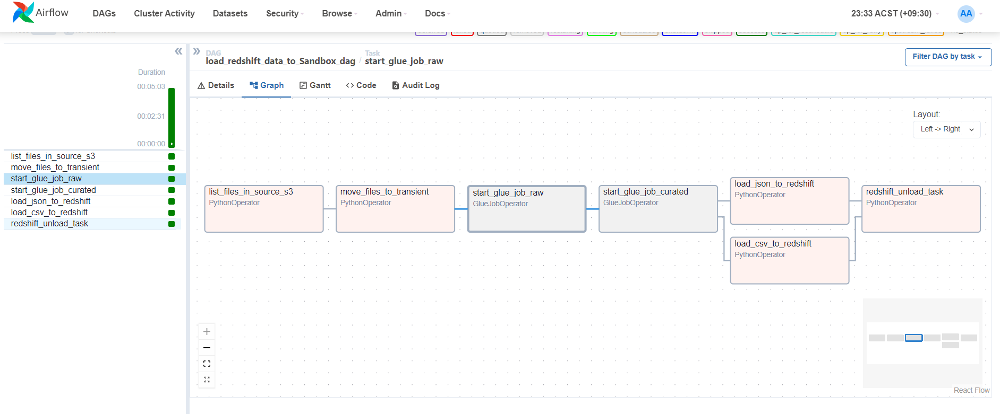

# Project Overview

This project aims to establish a data pipeline using ETL technology (Pyspark) to process 1 million video playback records (CSV file metadata) generated by a video streaming website within two days. The main objectives of this project include creating a data warehouse for basic video information, transforming semi-structured user registration information (JSON format) into user profiles, and automatically loading these data into Redshift. The project also involves conducting business queries, which include routine daily queries and ad-hoc queries of interest to stakeholders, and uploading the query results. This forms a comprehensive data lake functionality from data acquisition to business queries. The entire process is scheduled and managed by Airflow.

## Specific Steps Include:

### Data Collection and Cleaning:
- Extract play records from CSV files, process and clean the data to ensure data quality.
- Extract registered user information from JSON files, process and clean the data to ensure data consistency and integrity.

### Data Storage:
- Establish a data warehouse for basic video information, including key fields such as video ID, title, type, and release date.
- Store registered user information as semi-structured data to associate it with play records.

### Data Lake Construction:
- Constract 4 zones for different purpose of data storage in S3 bucket
- AWS Redshift
- Glue

### Business Query and Processing:
- Develop a series of queries and processing workflows to extract valuable information from the data, such as video play counts and user viewing behavior analysis.

### Data Visualization:
- Use data visualization tools to display key business metrics and analysis results to support decision-making.

By implementing this project, we will achieve efficient management and analysis of video play records and user information for the video streaming website, aiding in business decision-making and operational optimization.

# Project Implementation

## Data Quality Check or Layout Check
- file format
- column name ['DateTime','VideoTitle','events','id']
- Data-type check
- 'VideoTitle' structure checking

## Data Clean
- None value
- space trim in column 'VideoTitle'
- Outlier Check
  1. Numerical value check. 
  2. String length check. 
  3. Date value check. 
  4. Boolean value check

## Build Data Warehouse


## Build Date Lake
Date Lake was splited into four parts, as the figure shown. The establishment of Data Lake leveraged ETL technology by AWS Glue Job.


## Task Schedule

Use Airflow or Lambda to automatically schedule Glue jobs to create a data lake. Data scientists or data analysts can load data from the video-curated-bucket for analysis and store the output in the analytics-sandbox-bucket.




## Video Information example （Structured Data）

Q1 Find the program with highest click rate and the number of the click

+------+----------+--------------+--------------------------------------------------------------+  
| hour | topic_id | topic_number | videotopic                                                   |  
+------+----------+--------------+--------------------------------------------------------------+  
| 0    | 2061     | 9409         | Owen Hanson threatens gambler RJ Cipriani over missing $2.5m |  
| 1    | 260      | 7306         | Barack Obama delivers farewell address in Chicago            |  
| 2    | 2575     | 4478         | Texas 911 operator answers call from her own daughter about fire at her home |  
| 3    | 2575     | 5716         | Texas 911 operator answers call from her own daughter about fire at her home |  
| 4    | 2575     | 4828         | Texas 911 operator answers call from her own daughter about fire at her home |  
| 5    | 2575     | 5267         | Texas 911 operator answers call from her own daughter about fire at her home |  
| 6    | 2102     | 2734         | Pentagon tests world's largest drone swarm                   |  
| 7    | 2867     | 3141         | Trump slams unconfirmed reports of compromising Russia memo   |  
| 8    | 1104     | 3277         | Episode 2                                                    |  
| 9    | 2867     | 2345         | Trump slams unconfirmed reports of compromising Russia memo   |  
| 10   | 1104     | 4189         | Episode 2                                                    |  
| 11   | 1104     | 4402         | Episode 2                                                    |  
| 12   | 1104     | 2645         | Episode 2                                                    |  
| 13   | 1104     | 1137         | Episode 2                                                    |  
| 14   | 219      | 484          | Australian couple 'stranded' on glacier in Iceland           |  
| 15   | 219      | 566          | Australian couple 'stranded' on glacier in Iceland           |  
| 16   | 457      | 884          | Celebrity reaction to Streep's anti-Trump speech              |  
| 17   | 2121     | 7858         | Piers Morgan reduces mother to tears                         |  
| 18   | 2121     | 13283        | Piers Morgan reduces mother to tears                         |  
| 19   | 2121     | 17583        | Piers Morgan reduces mother to tears                         |  
| 20   | 2121     | 15578        | Piers Morgan reduces mother to tears                         |  
| 21   | 2121     | 14398        | Piers Morgan reduces mother to tears                         |  
| 22   | 2061     | 30764        | Owen Hanson threatens gambler RJ Cipriani over missing $2.5m |  
| 23   | 2061     | 14717        | Owen Hanson threatens gambler RJ Cipriani over missing $2.5m |  
+------+----------+--------------+--------------------------------------------------------------+


## User Information (Semi-structure Data)
Json Format

```plaintext
root
 |-- id: string (nullable = true)
 |-- profile: struct (nullable = true)
 |    |-- firstName: string (nullable = true)
 |    |-- jobHistory: array (nullable = true)
 |    |    |-- element: struct (containsNull = true)
 |    |    |    |-- fromDate: string (nullable = true)
 |    |    |    |-- location: string (nullable = true)
 |    |    |    |-- salary: long (nullable = true)
 |    |    |    |-- title: string (nullable = true)
 |    |    |    |-- toDate: string (nullable = true)
 |    |-- lastName: string (nullable = true)

```
## User Profile
Based on user Information to build user profile, including:

+ "jobDuration_weeks_max": The longest duration of employment in weeks.
+ "max_job_duration_title": The longest job title held during the career.
+ "avg_salary": Average salary earned.
+ "max_salary": Highest salary earned.
+ "max_job_salary_title": Job title associated with the highest earnings.
+ "num_jobTitle": Number of different job titles held.
+ "location": City of employment.
+ "num_jobLocation": Number of different cities worked in.

### some query for user information

+ Q1 What is the average salary for each profile? Display the first 10 results, ordered by lastName in descending order
```plaintext
+--------+---------+
|lastName|     mean|
+--------+---------+
|  Ronyak| 97714.29|
| Mumford|55333.332|
| Townsel|78666.664|
+--------+---------+
```
+ Q2 What is the average salary across the whole dataset
```plaintext
+-----------------+
|       avg_salary|
+-----------------+
|97461.87312420631|
+-----------------+
```
+ Q3 On average, what are the top 5 paying jobs? Bottom 5 paying jobs? If there is a tie, please order by title, location
```plaintext
+--------------------+---------+-----------+
|               title| location|mean_salary|
+--------------------+---------+-----------+
|procurement speci...|Melbourne|      99246|
|financial counsellor|Melbourne|      99161|
|safety superinten...|   Hobart|      99085|
|             trimmer| Brisbane|      99022|
|admin support off...|    Perth|      98975|
+--------------------+---------+-----------+
```
+ Q4 Who is currently making the most money

```plaintext
+---------+------------+--------------------+----------+----------+------+
|firstName|    lastName|               title|  fromDate|    toDate|salary|
+---------+------------+--------------------+----------+----------+------+
|    Ronda|     Zuidema|     devops engineer|2013-05-23|2024-07-10|159000|
|     Lori|     Zortman|Warehouse Storepe...|2018-11-23|2024-07-10|159000|
|    Mayme|        Zorn|    sales consultant|2017-02-23|2024-07-10|159000|
|      Kim|        Zahn|          specialist|2018-01-23|2024-07-10|159000|
|   Joseph|   Zaenglein|procurement speci...|2015-04-23|2024-07-10|159000|
|  Pauline|      Wylder|clinical psycholo...|2014-05-23|2024-07-10|159000|
|    Keith|      Wright|  pharmacy assistant|2018-11-23|2024-07-10|159000|
|  Matthew|       Woods|sales representative|2014-05-23|2024-07-10|159000|
|    James|        Wood|          hr advisor|2015-01-23|2024-07-10|159000|
...
|   Steven|       Shore|admin support off...|2016-09-23|2024-07-10|159000|
+---------+------------+--------------------+----------+----------+------+
```

+ Q5 What was the most popular job title started in 2019

```plaintext
+--------------------+---------+
|               title|num_title|
+--------------------+---------+
|sales representative|      197|
|admin support off...|      189|
|           paralegal|      185|
|  enrolments officer|      184|
|registration officer|      184|
|     counter manager|      179|
|     project manager|      179|
|     physiotherapist|      177|
|       sales manager|      175|
|  pharmacy assistant|      174|
+--------------------+---------+
```

+ Q6 How many people are currently working
df_user.withColumn("job_explode",explode("profile.jobHistory"))\
       .withColumn("toDate",col("job_explode.toDate"))\
       .withColumn("fromDate",col("job_explode.fromDate"))\
       .withColumn("salary",col("job_explode.salary"))\
       .withColumn("lastName",col("profile.lastName"))\
       .filter(col("toDate").isNull()&col("fromDate").isNotNull())\
       .count()

85187
    
+ Q7 For each person, list only their latest job. Display the first 10 results, ordered by lastName descending, firstName ascending order

```plaintext
+--------------------+---------+---------+--------------------+
|                  id|firstName| lastName|               title|
+--------------------+---------+---------+--------------------+
|91df4770-97b6-402...| Michelle|   Zysman|     physiotherapist|
|6068e4a5-4116-4ae...|    Brant|  Zylstra|    sales consultant|
|ebe590ab-5ef8-41d...|    Derek|  Zylstra|  service technician|
|231d590d-0117-475...|   Kelley|    Zylla|safety superinten...|
|4f903976-f7c0-414...|Katherine|  Zygadlo|   cosmetic injector|
|46c28eef-561c-429...|   Steven|Zwolinski|corporate consultant|
|7823aba8-4387-4d3...|    Roger|  Zwinger|Administration Of...|
|9255973c-f072-40c...|   Connie|   Zwiers|          technician|
|4988a110-27ce-44f...|     Mike|   Zwiers|           paralegal|
|67d75e21-71c9-4c3...|    Susan|    Zwieg|  pharmacy assistant|
+--------------------+---------+---------+--------------------+
```

+ Q8  For each person, list their highest paying job along with their first name, last name, salary and the year they made this salary. Store the results in a dataframe, and then print out 10 results

```plaintext
+----------+---------+------+----+
| firstName| lastName|salary|year|
+----------+---------+------+----+
|      Mark|      Roy| 83000|2024|
|     Ramon|   Willis|147000|2019|
|Evangeline|  Manning|110000|2019|
|    Samuel| Koesters| 95000|2019|
|     Lloyd|  Patrick|121000|2024|
|     James|   Harmon|113000|2024|
|       Ken|Biagiotti|153000|2024|
|    Harold|  Spooner|108000|2019|
|      Lois|   Sutton|110000|2024|
|      Paul|   Ortega|114000|2024|
+----------+---------+------+----+
```


